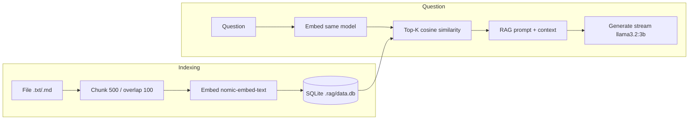

<div align="center">

# localrag

**Query your documents locally with AI — no cloud, no API keys.**

[](https://go.dev/)
[](https://ollama.com/)
[](https://sqlite.org/)

_Index `.txt` / `.md` files, retrieve the best chunks with cosine similarity, and answer questions with a local model — all on your machine._

[Features](#features) · [Quick start](#quick-start) · [Commands](#commands) · [How it works](#how-it-works)

</div>

---

## Features

- **Fully local** — Embeddings and chat go through [Ollama](https://ollama.com/) on `localhost:11434`; your files never leave your disk.
- **SQLite storage** — Pure Go driver (`modernc.org/sqlite`), no CGO. Index lives in `.rag/data.db`.
- **RAG pipeline** — Chunk → embed → store → embed question → **top‑k** retrieval → streamed answer.
- **Streaming answers** — Replies stream token-by-token for a responsive CLI experience.

## Prerequisites

1. **[Go](https://go.dev/dl/)** 1.26+ (see `go.mod`).
2. **[Ollama](https://ollama.com/)** installed and running (`ollama serve` is usually started automatically).
3. **Models pulled** (defaults below):

```bash
 ollama pull nomic-embed-text
 ollama pull llama3.2:3b
```

## Install

```bash
go install github.com/srijxnnn/localrag/cmd/rag@latest
```

Ensure `$(go env GOPATH)/bin` is on your `PATH`.

Or clone and run from source:

```bash
git clone https://github.com/srijxnnn/localrag.git
cd localrag
go run ./cmd/rag --help
```

## Quick start

```bash
# 1. Create a workspace (creates .rag/ and the database)
rag init

# 2. Index a file (supports .txt and .md)
rag add ./notes.md

# 3. Ask a question grounded in your docs
rag ask "What are the main points in this document?"
```

Override the chat model when you ask:

```bash
rag ask "Summarize the refund section" --model mistral
```

## Commands

| Command              | Description                                                                                                               |
| -------------------- | ------------------------------------------------------------------------------------------------------------------------- |
| `rag init`           | Create `.rag/` in the current directory and initialize the SQLite database. Fails if already initialized.                 |
| `rag add <path>`     | Read a **single** `.txt` or `.md` file, chunk it, embed with `nomic-embed-text`, and store vectors.                       |
| `rag ask <question>` | Embed the question, pick the top **3** chunks by cosine similarity, then stream an answer (default model: `llama3.2:3b`). |
| `rag list`           | Show indexed paths, chunk counts per file, and when each was added (RFC3339).                                             |

Global behavior:

- Run commands from the same directory as your `.rag` workspace (or ensure the process cwd matches where you ran `rag init`).
- If Ollama is down, embedding fails with a hint to run `ollama serve`. If a model is missing, you’ll get a `ollama pull …` suggestion.

## How it works



**Defaults** (see `internal/chunk` and `internal/cli`):

| Setting         | Value                                         |
| --------------- | --------------------------------------------- |
| Embedding model | `nomic-embed-text`                            |
| Chat model      | `llama3.2:3b` (`rag ask --model` to override) |
| Chunk size      | 500 characters                                |
| Overlap         | 100 characters                                |
| Top K           | 3                                             |
| Ollama URL      | `http://localhost:11434`                      |

## Project layout

```
cmd/rag/          # CLI entrypoint
internal/cli/     # Cobra commands (init, add, ask, list)
internal/chunk/   # Text chunking for .txt / .md
internal/ollama/  # HTTP client: embeddings + streaming generate
internal/store/   # SQLite schema and persistence
internal/search/  # Cosine similarity + TopK
```

## Limitations & roadmap

- Only `.txt` and `.md` files are supported for `rag add` today.
- Retrieval is **brute-force TopK over all chunks** — fine for small corpora; larger indexes may need a dedicated vector DB or ANN later.

Contributions and issues are welcome.
